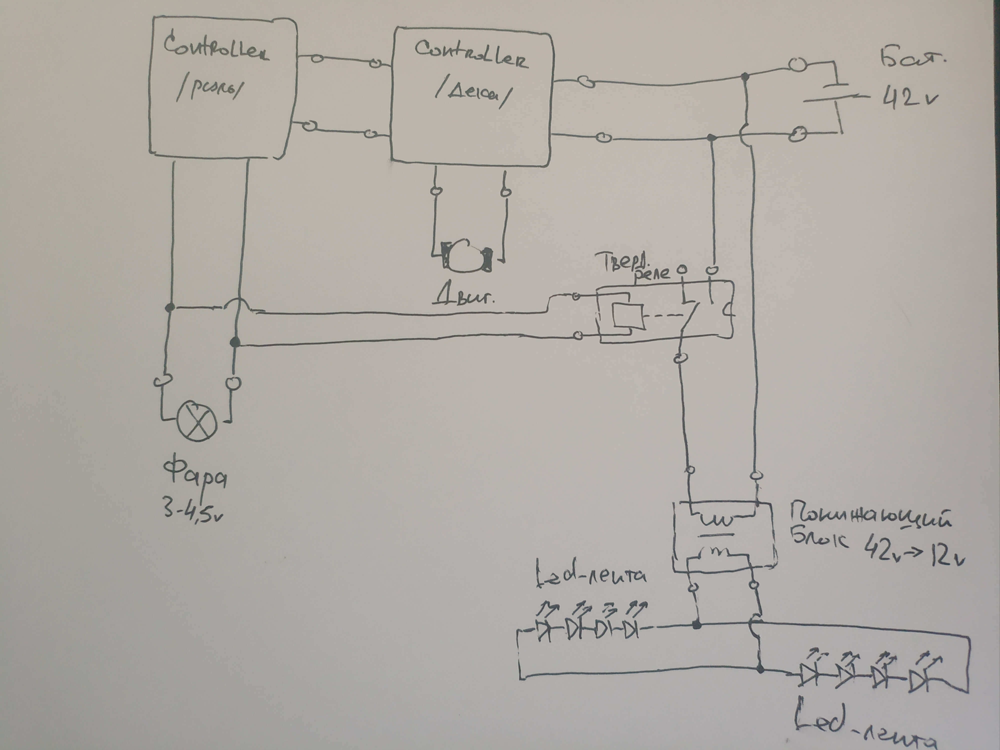
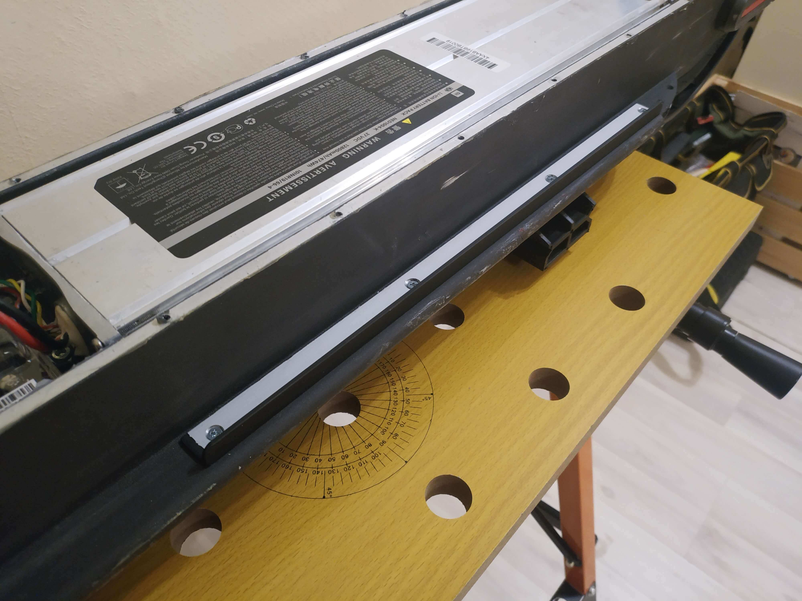
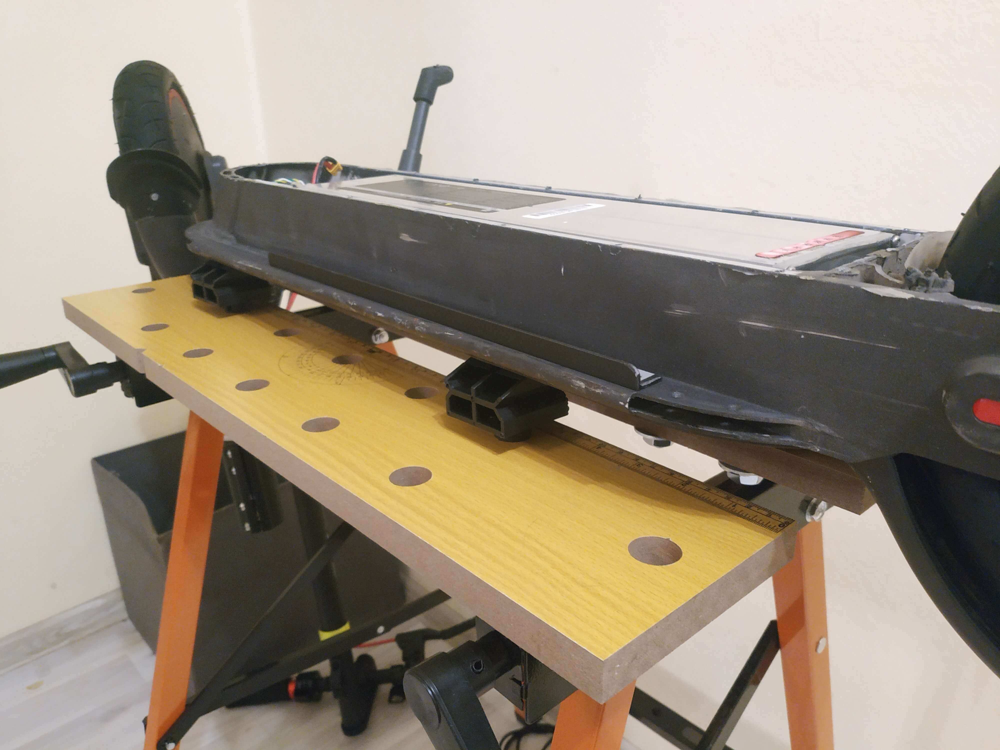
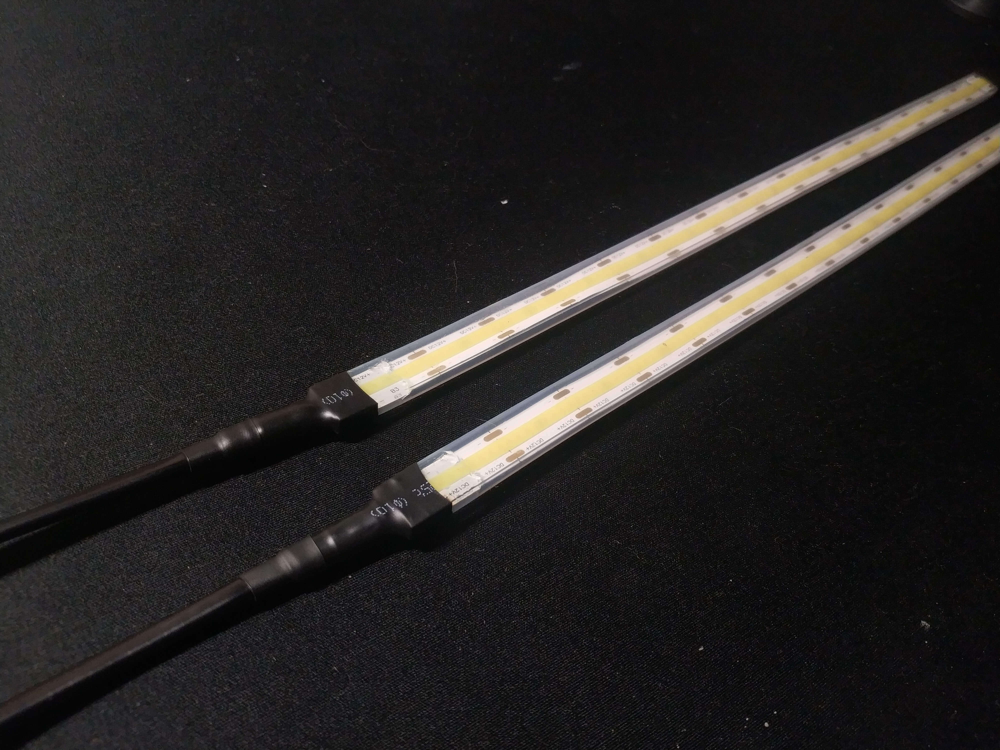
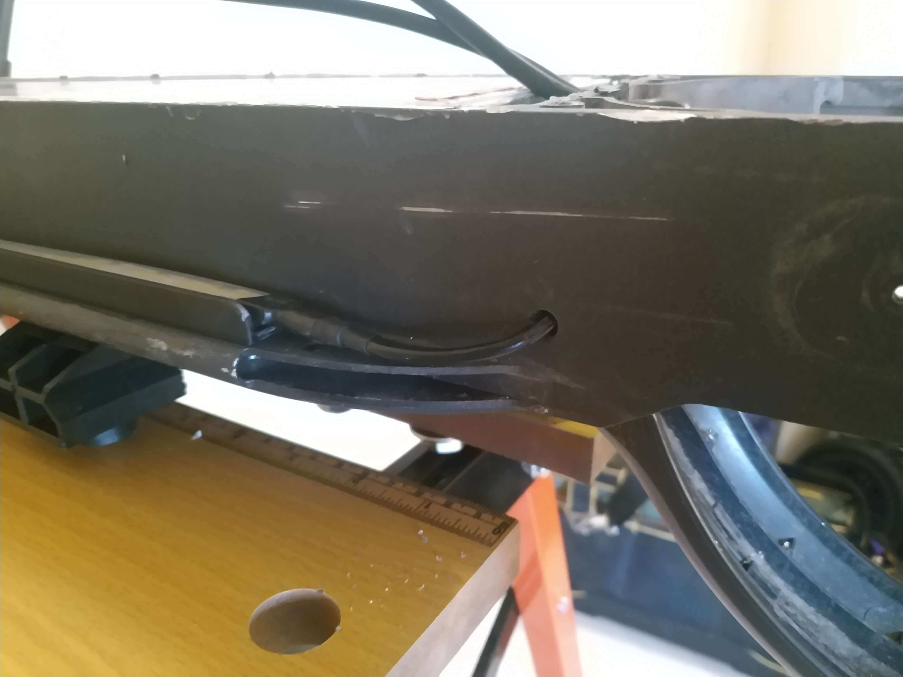
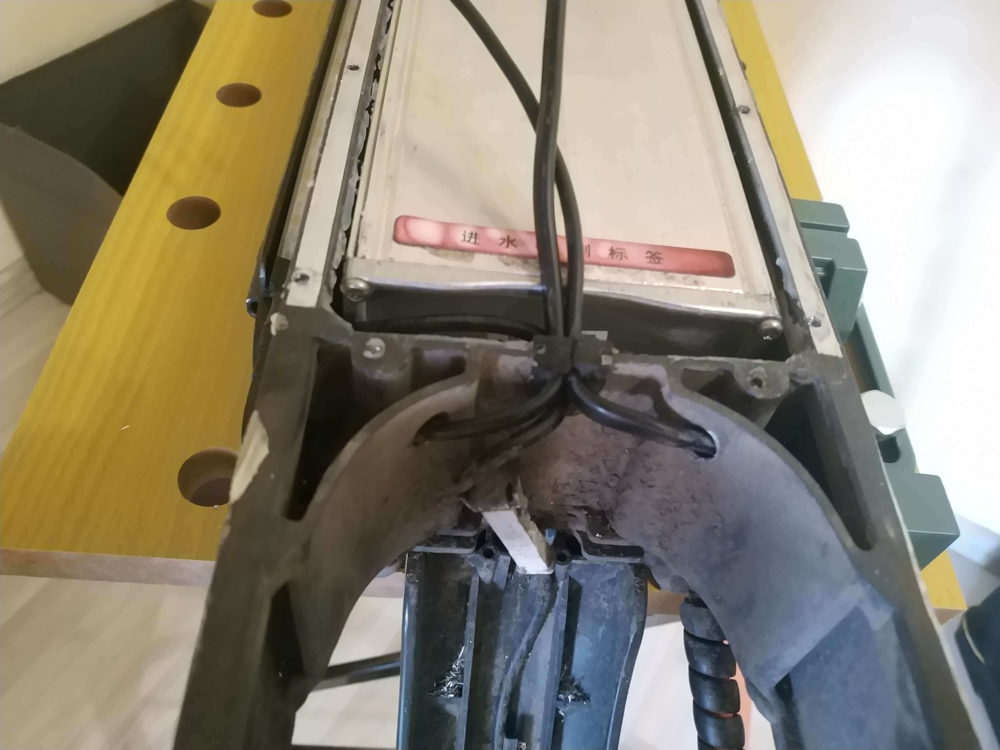
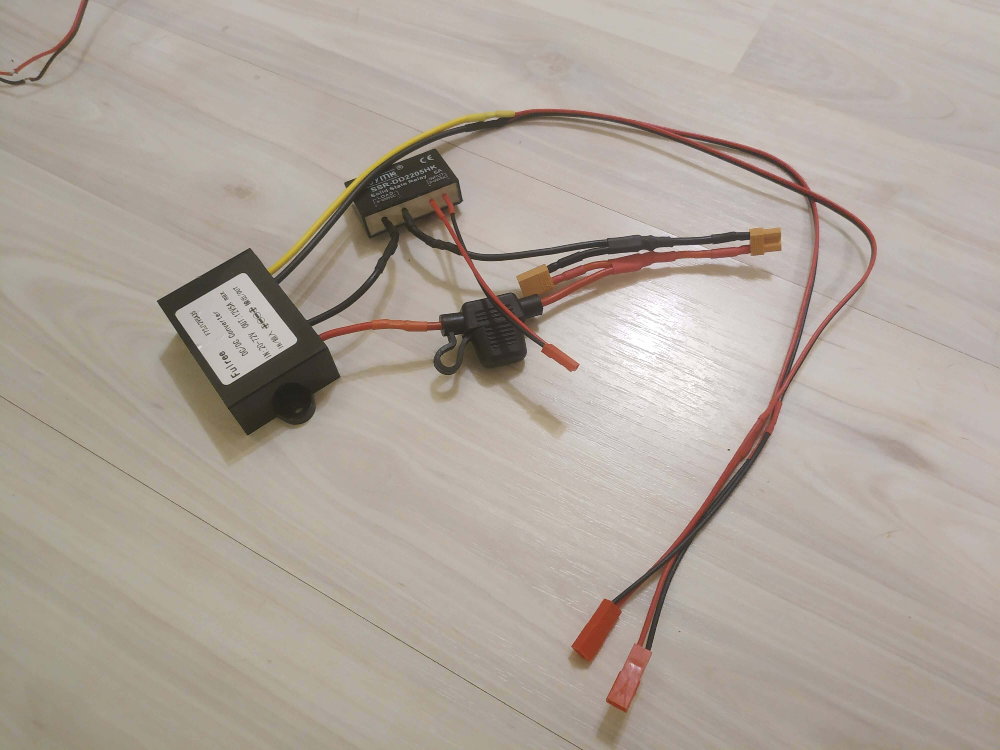
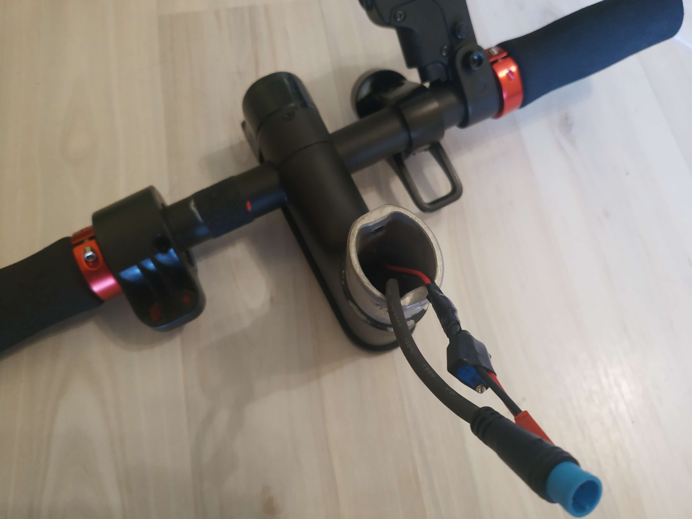
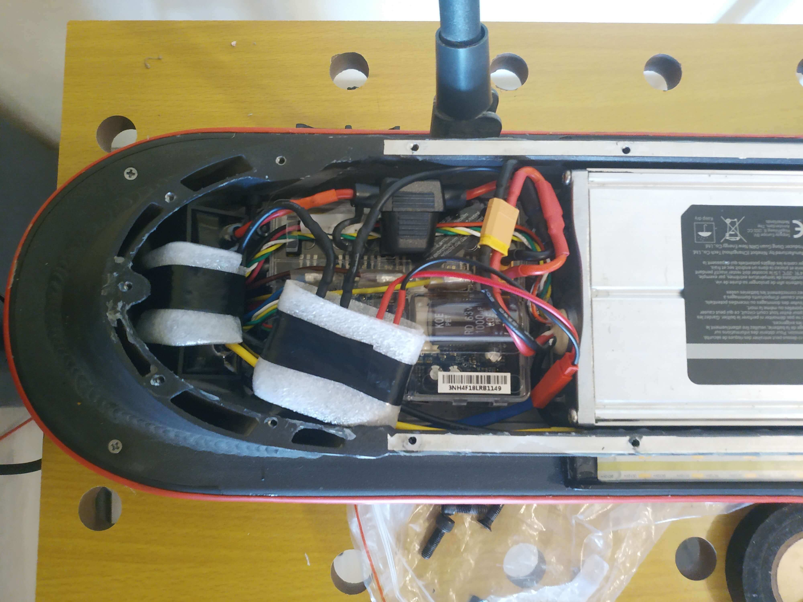
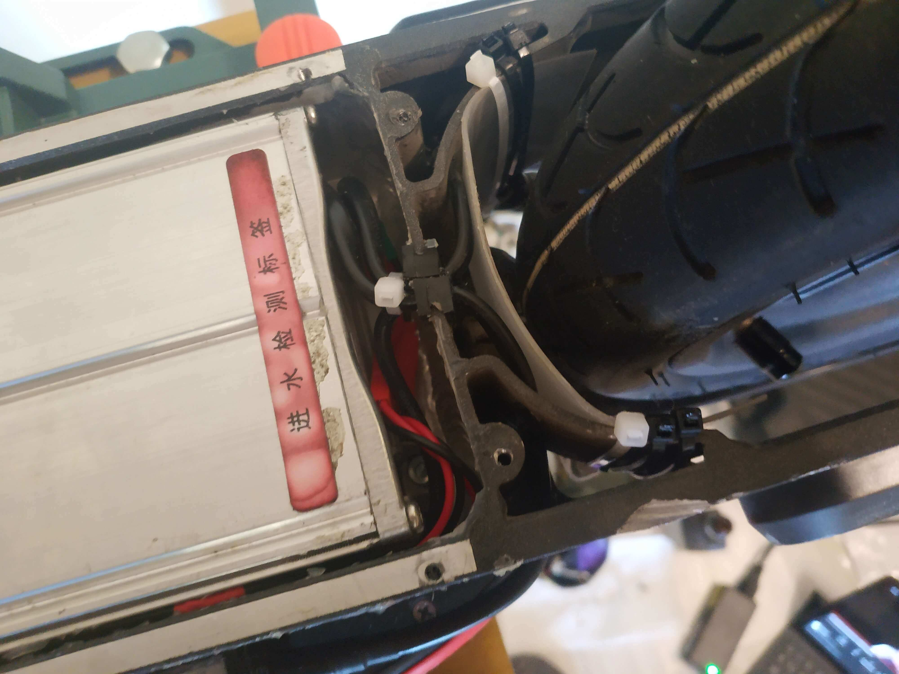

Как пользователь электро-самоката M365 версии Pro со стажем — могу смело заявить, что **быть заметным** как для участников дорожного движения, так и пешеходного — очень важно. Если передвигаясь днём по обочине дорог и/или тротуару можно считать что твоя заметность _достаточна_ для других участников движения _(недостаток с лихвой компенсируется светоотражающим жилетом)_, то вот в темное время суток картина сильно меняется. Особенно это чувствуется при движении по тротуару со включенной фарой - особенность устройства и расположения фары на самокате таковы, что идущих тебе на встречу ты просто слепишь, а сзади тебя не видно от слова совсем.

Задавшись вопросом "как это можно исправить" было принято решение интегрировать пару led-лент в днище самоката так, что бы они освещали землю под ним (тем самым обозначая твоё местоположение для других) и чтоб при этом надежность примененного решения не вызывала сомнения. Ниже будет в меру подробное описание того, как подсветка была имплементирована, какие комплектующие для этого были выбраны, их цены и с какими сложностями столкнулся.

<!--more-->

## Схема

Как решение любой задачи в программировании начинается с проработки алгоритма, тут всё началось с принципиальной схемы:

Если словами - то мы:

- Берем 2 светодиодные ленты на 12V, питаем их через понижающий блок
- Понижающий блок в свою очередь запитываем прямо от батареи самоката _(через предохранитель на 1A)_
- Для включения понижающего блока используем твердотельное реле, которое "включает" в работу нашу схему в тот момент, когда мы включаем фару

Таким образом нам не придется выводить какие-либо дополнительные кнопки для включения подсветки (интуитивность на максимуме), пока не включена фара у нас цепь разомкнута _(утечки тока минимальны, только через реле совсем чуть-чуть)_, да и в целом всё довольно просто.

> Делать RGB подсветку с управлением, например - силами Arduino по BT не стал осознанно.

## Комплектующие

Что делать - понятно, теперь разбираемся с элементной базой. Взял следующие штуки:

Наименование                                                                                                            | Цена
----------------------------------------------------------------------------------------------------------------------- | -----------
[LED ленты цвета "Cold White" 12V (IP67) в защитной тубе по 0.5м, 2 шт.](https://aliexpress.ru/item/4001022366326.html) | 879,70 ₽
[Понижающий преобразователь с 20..72V (DC) до 12V (DC) 5A 60W](https://aliexpress.ru/item/32886316508.html)             | 1 012,17 ₽
[Твердотельное реле SSR-DD2205HK на 5A](https://aliexpress.ru/item/32664722075.html)                                    | 296,53 ₽
[Малый предохранитель 1A на проводе 16 AWG](https://aliexpress.ru/item/4001295332182.html)                              | 54,40 ₽
[Провод 16AWG (черный и красный), по метру каждого цвета](https://aliexpress.ru/item/4000009001537.html)                | 179,51 ₽
[Провод 28AWG двужильный, 5 метров](https://aliexpress.ru/item/4000567154018.html)                                      | 348,15 ₽
[Разъемы XT30 с проводом 16AWG, 3 шт.](https://aliexpress.ru/item/4000508049106.html)                                   | 378,46 ₽
[Разъемы двух-контактные на проводе 22AWG](https://aliexpress.ru/item/33023814410.html)                                 | 122,09 ₽

Итого вышло на ~3 300 ₽, и самое дорогое - это понижающий блок. Взял его осознанно "подороже", так как и его форм-фактор в виде залитого эпоксидной смолой блока подкупил, и положительные отзывы.

## Железо

Первое, что было сделано - это "закладные" для лент на днище деки (по её бокам) самоката. Их цель - защитить ленты от каких-либо механических воздействий (неудачных "соскоков" с бордюров) и скрыть сам факт присутствия какой-либо кастомизации от любопытных глаз. Для этого в Leroy Merlin приобрел [уголок алюминиевый 15х10х2 мм](https://leroymerlin.ru/product/ugolok-alyuminievyy-15h10h2-mm-13014866/) и [болты потайные M3x10 мм.](https://leroymerlin.ru/product/vint-potaynoy-m3h10-mm-13622511/) (лучше было бы 5 мм.). Далее дело было за малым:

- Примерить (у меня длинна каждого составила 32.5 см.), отрезать, обработать края алюминиевого уголка
- Просверлить по 4 отверстия и за-зенковать их
- Нарезать резьбу под M3 в отверстиях деки
- Загрунтовать и покрасить заготовки
- На фиксатор резьбы (анаэробный клей) вкрутить винты (прикрутить уголки к деке)

## Ленты

Ленты были безжалостно распотрошены и укорочены под длину получившихся закладных. Кроме того провод был заменен на более мощный с толстой изоляцией, так как он будет находиться во внешней среде, и тут я решил заложиться с некоторым запасом. После всех манипуляций с заменой провода края защитной "тубы" залил бесцветным герметиком [Fix All Crystal](https://leroymerlin.ru/product/kley-germetik-fix-all-crystal-bescvetnyy-290-ml-81967174/) (к слову - именно его буду использовать и дальше для герметизации стыков и заполнения пустот). Кроме того - края лент были упакованы в термо-усадку, и получилась такая красота:

Далее монтируем ленты в закладные, попутно сверля необходимые отверстия (по 2 штуки на каждую сторону) и выводим провода лент через "родное" уплотнительное кольцо стоп-сигнала внутрь деки самоката:

Далее приклеиваем ленты на двухсторонний скотч к закладным, а свободное пространство между защитным кожухом лент и корпусом деки/закладных заполняем всё тем же прозрачным герметиком (не дадим грязи повода скапливаться в образовывавшихся пустотах). Если надо будет ленту заменить - просто срежем всё это добро ножом и зачистим растворителем.

## Электроника

Вооружившись паяльником и поглядывая на нашу схему собираем все части схемы воедино:

Длину проводов подгоняем "по месту", а на концы LED-лент припаиваем двойные разъемы так, чтоб всё это добро соединялось без натяжки, но и без сильных излишков.

> Небольшое отступление не по теме сабжа - во время этого этапа ещё и дорожки мосфетов на контроллере усилил, и клеммы подключения мотор-колеса к контроллеру пропаял. Последние, к слову - уже начали отгарать, и их обслуживание пришлось как раз вовремя - через несколько месяцев "покатушек" они наверняка отгорели бы окончательно.

Теперь дело за подключением фары самоката к твердотельному реле (чтоб когда мы включили фару - у нас загорелись LED-ленты). Для этого разбираем "голову" самоката, и разрезав провод питания фары (желто/белый) припаиваем к нему дополнительный разъем (к которому в дальнейшем подключим провод, что потянется до деки). И тут я должен рассказать одну тонкость - на фару подается следующее напряжение:

Самокат включен? | Фара включена? | Фара подключена? | Напряжение
---------------- | -------------- | ---------------- | ----------
Нет              | Нет            | Да               | -
Да               | Нет            | Не важно         | 3.7V ("дежурное" напряжение)
Да               | Да             | Да               | 4.1V
Да               | Да             | Нет              | 36.3V

Простыми словами - разница между состояниями "фара включена" и "фара выключена" (когда фара исправно светится) в напряжении составляет всего 0.4V, а наше твердотельное реле открывается при напряжении от 3V на управляющем вводе. То есть нам нужно понизить значение "дежурного" напряжения ниже 3V но так, чтоб при включении фары оно было выше этих самых 3V. Сделал это при помощи потециометра (`BAOTER 3296 - W 103`), что был безжалостно выпаян из какого-то другого регулятора напряжения, что попался под руку. Итоговое сопротивление замерить забыл, каюсь, так что подобрать его придется самостоятельно.

> Ещё одно важное замечание - верхний предел напряжения на управляющем вводе нашего твердотельного реле составляет 32V, и в случае если фара выйдет из строя (не будет потребителя на выводе контроллера, к которому подключена фара) на него будет подаваться 36.6V, что не есть хорошо. Да, у нас стоит сопротивление для понижения напряжения, но долго ли проработает в этом случае реле - предсказать сложно. Надо просто это помнить и в случае выхода фары из строя - заменить её, либо повысить сопротивление.

Проверив работоспособность схемы собираем всё "как было", выводя с фары дополнительный коннектор рядом с родным (потенциометр я "посадил" прямо на новый вывод в термо-усадке, чтоб была возможность при необходимости подстроить его с минимальными усилиями):

Теперь финишная прямая - аккуратно укладываем все новые компоненты в деке (прокладывая их чем-либо мягким чтоб сидели плотно):

И через "гуся" да рулевую стойку протягиваем провод, соединяющий вывод фары (после потенциометра) и выводы управления твердотельного реле. Герметизируем деку, закручиваем всё, герметизируем резиновые уплотнители на "гусе" и рулевой стойке (чтоб там пролез дополнительный провод - их придется немного подрезать) герметиком и наслаждаемся результатом!

Потребляемая мощность в моем конфиге составляет 1.1 Вт при выключенном свете, и **12.3 Вт** когда включена фара + подсветка из LED-лент. За 1 час работы аккумулятор самоката разряжается примерно на 100 мА/ч (из 12800 в стоке), что составляет менее процента от общего объема (замерял при помощи родного приложения, вкладка информации о батарее). Компоненты не греются, совсем (исключением является лишь led-ленты, но даже их повышение температуры еле-еле ощутимо рукой).



### Ссылки

- [Комментарий с рекомендацией использовать 4ю ногу драйвера фары или Arduino 1wire](https://4pda.ru/forum/index.php?showtopic=828424&view=findpost&p=104670445)
